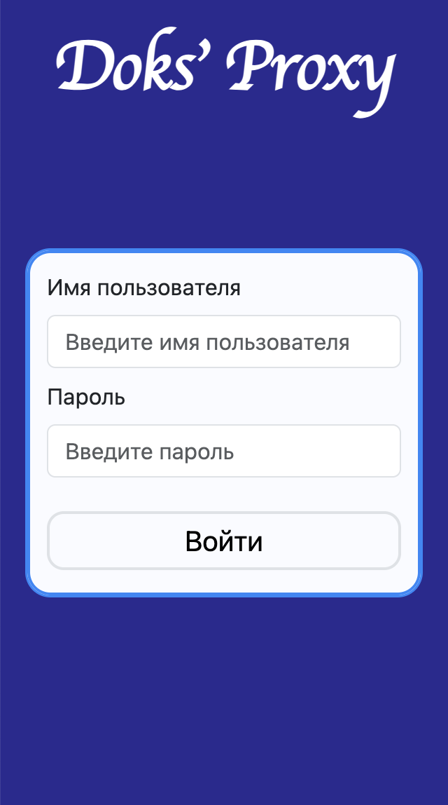
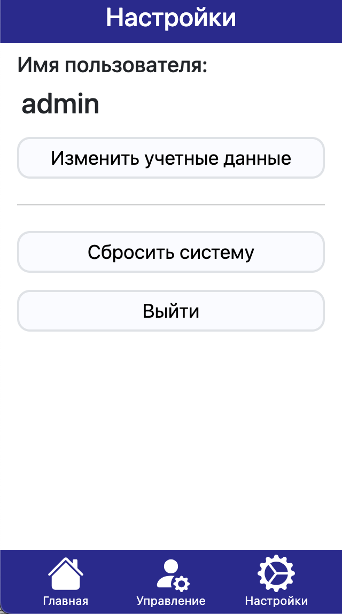

## Выпускная квалификационная работа

**Тема**: Цифровой сервис мониторинга и управления доступом к интернет ресурсам.

Подробности в файле "report".

#### Демонстрация

  
&nbsp; &nbsp;
  

  
&nbsp; &nbsp;
  

  
&nbsp; &nbsp;
  

  
&nbsp; &nbsp;
  

    
&nbsp; &nbsp;
  

  
&nbsp; &nbsp;
  

  
&nbsp; &nbsp;
  

